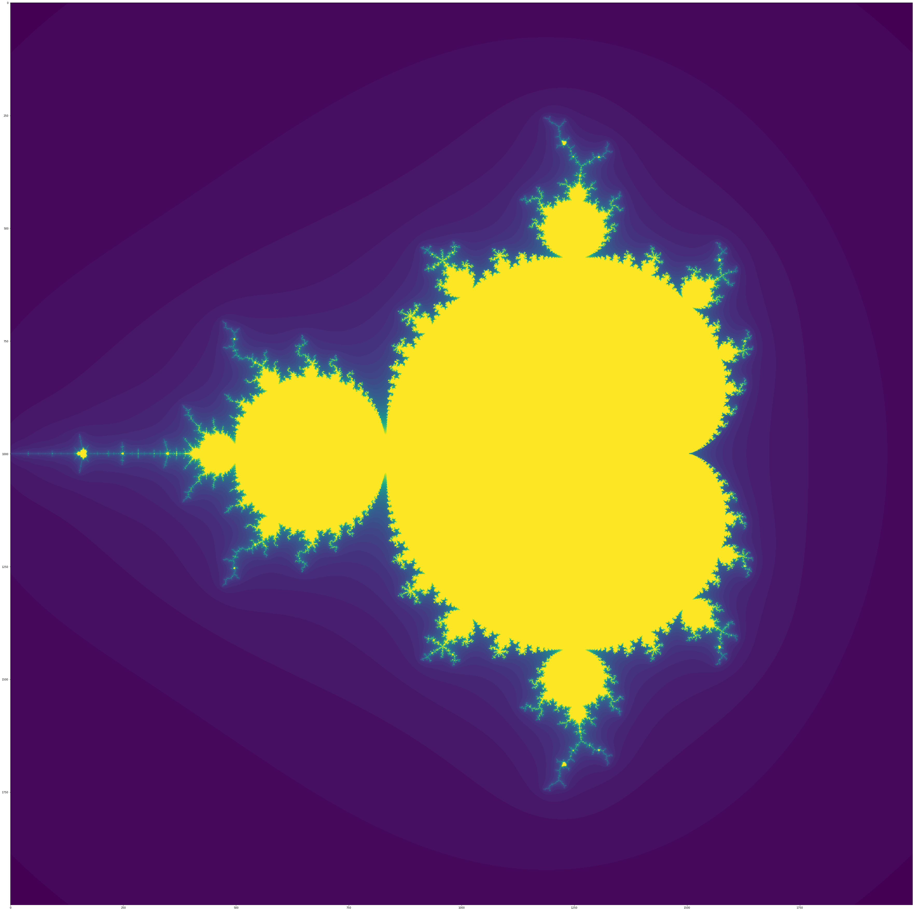
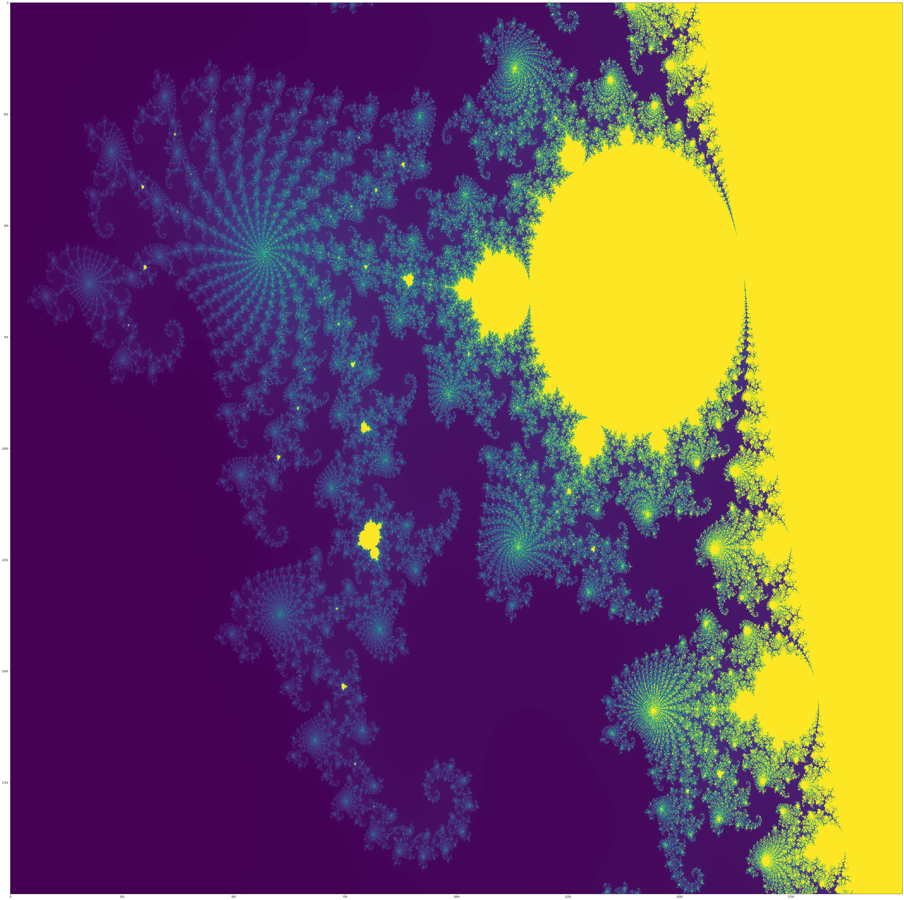

# Mandelbrotmenge-
A Python algorithm created to calculate the Mandelbrotmenge in a very efficient way. You can get really amazing pictures with this. For diffrent pictures you just have to change the coordinates and maybe the iteration depth.

You can look at two pictures I generated (names: mandel1 & mandel2) but please note the pictures have a very high resolution so you can not really look at them in the browser you should better download them. But with the algorithm you can generate these pictures by yourself.

